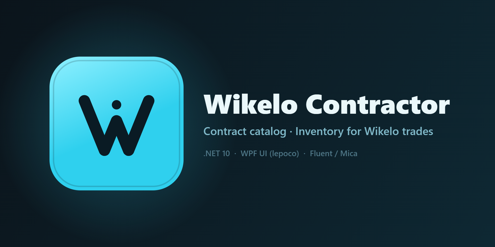

# Wikelo Contractor

Windows companion app for **Wikelo** trades in Star Citizen.

- **Catalog** — all Wikelo contracts (data from the [Star Citizen Wiki API](https://api.star-citizen.wiki/))
- **Inventory** — tracking of collected resources with per-contract progress and an in-game overlay

## Stack

.NET 10 · WPF · [WPF-UI (lepoco)](https://github.com/lepoco/wpfui) · CommunityToolkit.Mvvm · Generic Host DI

## Getting started

```powershell
dotnet restore
dotnet run --project src/WikeloContractor.csproj
```

In VS Code: `Ctrl+Shift+B` — build, `F5` — run with debugger (VS Code will suggest the recommended extensions).

### VS Code profile (optional)

VS Code cannot disable extensions per workspace via config files. To work with a clean,
minimal extension set, import the bundled profile once: `Ctrl+Shift+P` →
**Profiles: Import Profile...** → select [WikeloContractor.code-profile](WikeloContractor.code-profile),
then switch to it in this workspace (`Ctrl+Shift+P` → **Profiles: Switch Profile**).
VS Code remembers the chosen profile per workspace.

## Tests

```powershell
dotnet test tests/WikeloContractor.Tests.csproj
```

## Documentation

- [PLAN.md](PLAN.md) — development plan by phases
- [CLAUDE.md](CLAUDE.md) — project context for Claude Code
- [docs/data-pipeline.md](docs/data-pipeline.md) — catalog data: caching, enrichment, rate limiting
- [docs/ui-notes.md](docs/ui-notes.md) — UI patterns and WPF-UI quirks
- [docs/testing.md](docs/testing.md) — test layout and conventions
- [docs/api-item-fields.md](docs/api-item-fields.md) — field inventory of the item/vehicle API responses
- [docs/reward-images.md](docs/reward-images.md) — which reward items still need a manual image URL

## License, attribution & disclaimer

- The application source code is licensed under the [MIT License](LICENSE).
- Game data is provided by the [Star Citizen Wiki API](https://api.star-citizen.wiki)
  (community-maintained, unofficial). Per its terms of use, this credit is required for
  public projects, and commercial use of the data is not permitted.
- This is an unofficial fan-made application, not affiliated with or endorsed by
  Cloud Imperium Games or Roberts Space Industries. Star Citizen®, Roberts Space
  Industries® and Cloud Imperium® are registered trademarks of Cloud Imperium Rights LLC.
  All game data belongs to Cloud Imperium Games.
